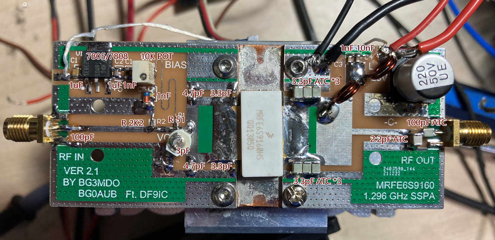

# Budget MRFE6S9160 LDMOS Transistor 23cm band 1.3GHz 150 Watt Solid State Power Amplifier (SSPA)

MRFE6S9160 (E is an enhanced version of MRF6S9160, but there is no difference for the RF matching and general performance) is commonly found in many old GSM base-station systems and used as a final stage power amplifier (PA) device. We have seen there are already many excellent 23cm band 1.3GHz PAs built with this transistor. The one designed by DF9IC is very popular.  

MRFE6S9160 is easy to get from the Asian market, usually sold as a second-hand component, where they are removed from used base stations. That means this LDMOS transistor is super cheap compared to many other similar devices. However, there are some issues, for example, this device comes without many documents, S-parameter information and simulation models. Therefore, this makes computer-aided design is more difficult on this device.

BG0AUB, ZHAO Feng, and I seat together, well virtually as I was in the UK, and considered were we able to make an even budget 23cm band PA for an EME project. Yes, we did. After a few design iterations, we have made the FR4 substrate 23cm band MRFE6S9160 PA, and decided to open-source it. The board can be fabricated by JLC 0.8mm 1zo technology.

We have learnt a lot from this project, including high power RF related knowledge and the use of design/simulation tools. In addition, Feng had spent massive time on this – practical installation and testing work.

DF9IC has made a FR4 substrate experiment, but the result was not grate. We started from there, and further analysing his work. Feng and I considered there were rooms to improve, and FR4 would be still a solution for 23cm band PA designs. After playing with computer simulations, I decided to change the layout, so making rooms for better matching. 

The following pictures show the new layout:

&nbsp;

PA 3D look (Specially thanks to BG7GBC for the generation of 3D picture):

&nbsp;

&nbsp;

The PCB needs to be cut into two halves to create the space for LDMOS.

The installation process should be straightforward, and tuning process is not complex. In older to test this PA, a 28V 20A PSU is needed. Overcurrent protection one is more expected. After the solder process, the PA should be looking like as follows:

Note that the PA will produce massive heats, so a good heatsink should be given. LDMOS quiescent current is sensitive to temperature. The bias circuit can be upgrade to temperature compensation ones as well. Our dual LDMOS power combined PA has replaced the simple biased circuit with an enhanced one.

## BOM and Assembly

BOM table as follows:

|Component|Name|Package|Quantity|
|:----:|:----:|:----:|:----:|
|1uF 50V|MLCC Capacitor|C 0805|2|
|1nF 50V|MLCC Capacitor|C 0805|3|
|10nF 50V|MLCC Capacitor|C 0805|1
|100pF 100V|C0G Capacitor|C 0603|1
|3.3pF 100V|C0G Capacitor|C 0603|2
|4.7pF 100V|C0G Capacitor|C 0603|2
|100pF 500V|ATC500B Capacitor|C 1210|1
|3.3pF 100V|ATC500B Capacitor|C 1210|6
|2.2pF 500V|ATC500B Capacitor|C 1210|1
|100uF/50V|Aluminum Electrolytic Capacitor|CT 10*8-C|1
|SMA|SMA Female Connector|SMA-KE|2
|MRFE6S9160|N-CHANNEL RF LDMOS|MRFE6S9160HR3/HSR3|1|
|51R|Chip Resistor|R 0603|1|
|2K2|Chip Resistor|R 0603|1|
|LM7808/05|Regulator|TO252|1|
|3224W-1-103E|10K Variable Resistor|3224W1205E|1|
|3pF Variable Cap|High Q Cap Trimmer|3P-6mm|1|

Schematic of the PA:

Assembly:

R1 can be 47 or 51 Ohm, two coils are 1.5mm thick enameled wire, 1.5T on a 6mm drill bit.

## Turning procedure:

**VERY IMPORTANT**, BEFORE STARTED, MAKE SURE your ground wires and PA board ground are connected properly and firmly.

- Make sure the bias pot is at minimum settings - low voltage applying to LDMOS gate!

- Setting the bias pot, voltage, we should set the LDMOS at 1.3A quiescent current (Id). 

- The positions of six 3.3pF ATC capacitors should be mounted to the PCB silk screen indicated locations.

- For the input side, the 3pF variable capacitor turning is needed. A better input matching can be then obtained – input VSWR (S11) should be < 1.5.

- Generally saying, when the input is around 2 Watts, the PA will consume around 8A current and output > 60 Watts. In this case, some fine tuning can be performed – moving upper/lower three ATC capacitors together left or right 1mm each time in order to obtain the maximum output.

- Large signal gain of this PA is around 16-17 dB. If the PA current is under 7A where input is 2W, or even less, you will need to move these 3.3 pF left/right harshly, 2mm for example, and try to find a point that you have a good current reading. Some bad ATC capacitor will cause the low current/power issue too, so you should consider to replace these capacitors in the case no proper power generated. A large current is a good sight of outputting expected power.

- When the input power around 6W, you should see the output is nearly saturated – output compressed. 

- Excessive solder is not recommended for any pads, including LDMOS gate and drain pads. 

## Some Results:

There are some testing results, we know the board and LDMOS have variations, but, generally saying, based on a few builds, the output power level and gain of this design is stable. One of the testing results (Id = 1.3A and Vcc = 28V):

A plot of the output power and current:

VY 73!

BG3MDO (Yuan) and BG0AUB (Feng)

CC BY-SA 4.0